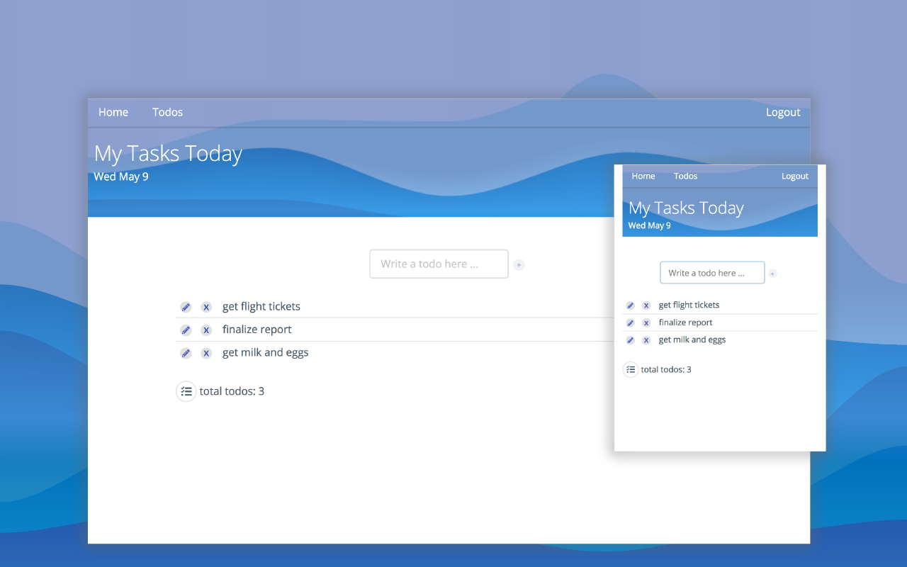

# My Tasks Today

This is a react.js application that allows the user to create a list of tasks. The list is editable. The app makes API calls to get and store tasks.



This project was bootstrapped with [Create React App](https://github.com/facebookincubator/create-react-app).


## Technologies used:

React.js, Axios, JavaScript, HTML5, CSS3, Semantic-UI-React

## Process/approach:

Whiteboard basic concept

Create wireframe using Sketch

Create assets using Adobe Illustrator (background image, logo)

<!--  -->

Create Client side including list of todos and a home section

Optimize images and files (compression, minification, etc.)


## Unsolved problems:

Inline editing of todo item.

## Biggest wins and challenges:


## Code Snippets

#### Set state to display current date on header

```
Header.js

...

//gets day, month
var d = new Date()
  .toString()
  .split(" ")
  .splice(0, 3)
  .join(" ")
  // regex number without leading zeros
  .replace(/\b0/g, "");

this.state = {
  date: d
};

...

<div id="title">
  <h1>My Tasks Today</h1>
  <p>{this.state.date}</p>
</div>

```
### React router for keeping track of URLs

```
routes.js

<Switch>
  <Route exact path='/' component={ Home }/>
  <Route path='/todos' component={ TodosContainer }/>
</Switch>
```

### CRUD for tasks

```
TodosContainer.js

...

class TodosContainer extends Component {
  constructor() {
    super();
    this.state = {
      todos: [],
      editingTodoId: null,
      editing: false
    };
    //bound to the container component
    this.createTodo = this.createTodo.bind(this);
    this.deleteTodo = this.deleteTodo.bind(this);
    this.updateTodo = this.updateTodo.bind(this);
    this.editTodo = this.editTodo.bind(this);
  }
  createTodo(todo) {
    let newTodo = {
      body: todo,
      completed: false
    };
    TodoModel.create(newTodo).then(res => {
      let todos = this.state.todos;
      let newTodos = todos.push(res.data);
      this.setState({ newTodos });
    });
  }

  deleteTodo(todo) {
    TodoModel.delete(todo).then(res => {
      let todos = this.state.todos.filter(function(todo) {
        return todo._id !== res.data._id;
      });
      this.setState({ todos });
    });
  }

  updateTodo(todoBody) {
    var todoId = this.state.editingTodoId;
    function isUpdatedTodo(todo) {
      return todo._id === todoId;
    }
    TodoModel.update(todoId, todoBody).then(res => {
      let todos = this.state.todos;
      todos.find(isUpdatedTodo).body = todoBody;
      this.setState({ todos: todos, editingTodoId: null, editing: false });
    });
  }

  editTodo(todo) {
    this.setState({
      editingTodoId: todo._id,
      editing: true
    });
  }
  ```
  ### Semantic UI to keep things tidy

  ```
  <List.Item data-todos-index={this.props.todo.id}>
    <List.Content labelposition="left">

      <Button
        className="btn btn-icon"
        circular
        icon="write"
        onClick={this.editClickedTodo}
      />

      <Button
        className="btn btn-delete"
        circular
        onClick={this.deleteClickedTodo}>
        X
      </Button>

      <div className="todo-items-list">{this.props.todo.body}</div>
    </List.Content>
    {this.props.editingTodoId === this.props.todo._id ? (
      <TodoForm
        autoFocus={true}
        onKeyUp={this.handleEditingDone}
        onUpdateTodo={this.props.onUpdateTodo}
        todo={this.props.todo.body}
        buttonName="Update Todo!"
      />
    ) : (
      ""
    )}
  </List.Item>
  ```


  ### CSS3 variables for code maintainability

  ```
index.css

  :root {
      /* COLORS */
       --nav-dark-bg-color: linear-gradient(to right, #5288EC, #5872E2);
       --main-dark-bg-color: #5872E2;
       --main-light-bg-color: #FBFCFC;
       --main-dark-text-color: #4a5b6c;
       --main-light-text-color: #FBFCFC;
       --main-secondary-color: #3f51b5;
       --main-accent-color: #ec6c52;
       --main-secondary-accent-color: #5288EC;
      /* FONTS */

       --main-font-family: "Open Sans","Roboto","-apple-system","BlinkMacSystemFont","Helvetica Neue","Segoe UI","Oxygen","Ubuntu","Cantarell","Noto Sans",sans-serif;
       --nav-font-family: -apple-system, BlinkMacSystemFont, "Segoe UI", Helvetica, Arial, sans-serif, "Apple Color Emoji", "Segoe UI Emoji", "Segoe UI Symbol";
  }
  ```

### Adobe Illustrator for creating background


